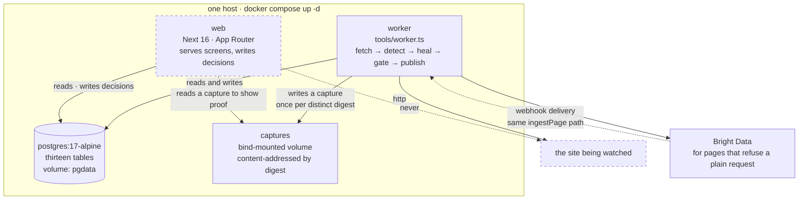
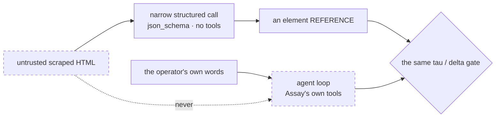

Two processes over one Postgres, and **Next never runs a scrape.**



## The boundary

The dashed line is the design decision, and it is not about tidiness.

> A scrape holds a request open and competes with page loads, which is why it
> does not belong in a route handler even self-hosted, where no timeout applies.

So `worker` is a separate service rather than a route in `web` — the same image,
a different entrypoint. `docker-compose.yml` says the same thing in its own
comment: *"The worker owns fetch → detect → heal → gate → publish. It is a
separate service, not a route in `web`."*

`src/runner.ts` takes `fetch` as a parameter. That is what lets the local worker
and the Bright Data webhook path run **identical detection and gating** — there
is no second, weaker code path that arrives over a webhook.

## The three services

| Service | Image | What it owns |
|---|---|---|
| `web` | `build: .`, `npm --workspace web run start` | Serves the screens and the REST surface; writes decisions. Port 3000. |
| `worker` | the same image, `npx tsx tools/worker.ts` | The whole pipeline. `restart: unless-stopped`. No ports. |
| `postgres` | `postgres:17-alpine` | The store. Healthchecked with `pg_isready`; both other services wait on `condition: service_healthy`. |

`web` and `worker` are one build artifact with two commands, so there is one
image to maintain and test. The hosted instance runs the same one.

## The captures volume

Page captures live on a mounted volume, **content-addressed by digest, never in
the database**.

```
volumes:
  - captures:/data/captures     # both web and worker mount it
```

Three consequences worth knowing:

- **An unchanged page is the same file.** The last replay over the corpus stored
  47 captures and deduped 19.
- **Pruning is `rm`.** No table to vacuum, no blob column to rewrite.
- **The path is a real path, and it matters.** `ASSAY_CAPTURES` defaults to
  `captures` relative to the working directory. Everything except Next runs from
  the repository root; Next runs from `web/`, where that directory does not
  exist — so `web/next.config.ts` resolves it back to the root before any route
  module loads. Nothing throws when this is wrong, which is the danger: a
  missing directory makes `hasCapture` answer false, `src/health` grade every
  run as unobserved, and the Fields screen report *"0 observations of this
  field"* for a field with twenty-eight of them. A false statement, rendered
  confidently, from a missing directory.

## Why webpack and not Turbopack

`web` builds with `next build --webpack`, and that flag is deliberate.

The engine is `module: NodeNext`, so every relative import inside it is written
`./schema.js` and resolves to `./schema.ts` — TypeScript's extension
substitution, which is not optional under NodeNext. Turbopack has no equivalent
of webpack's `resolve.extensionAlias` and cannot follow those specifiers
([vercel/next.js#82945](https://github.com/vercel/next.js/issues/82945), open as
of 2026-08-22), so a Turbopack build fails on `Can't resolve './schema.js'` the
moment a route imports `assay/store`.

Six lines in `next.config.ts`, deletable the day that issue lands. The
alternatives were worse: dropping `.js` from every engine specifier ties the
repository to a resolver Node does not implement, and compiling the engine to
`dist/` first puts a build step between editing an engine file and seeing it in
the app.

## Where the model sits, and where it does not



The rule that decides which, from `docs/STACK.md`: **operator input may reach an
agent loop; scraped page content may not.**

That is structural rather than a filter. The model returns an element
*reference*, never a string, so Assay reads the node's text out of the DOM
itself and no model-produced string ever reaches your data. The worst a hostile
page achieves is pointing at the wrong element — which the scorer disagrees
with, which is itself grounds to abstain. The attack lands in the review queue
instead of in the data.

Handing that same page to an agent holding `Bash` and `Write` would trade a
structural guarantee for a filter, which is why the agentic surface runs with
`disallowedTools: ["Bash", "Write", "Edit"]` — a bare name there removes the
tool from the model's context entirely rather than prompting for it.

<Callout>
  `docs/AI-AND-AGENTS.md` opens with *"Status: design. Nothing here is
  implemented."* The diagram above is the designed shape, not a description of
  shipped code.
</Callout>
