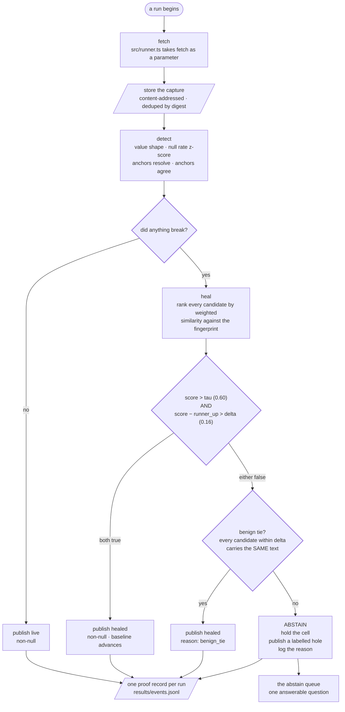

One pipeline, owned by `worker` and implemented in `src/runner.ts`.



## The gate is the product

The decision node in the middle is the whole thesis:

```
score > tau (0.60)   AND   score - runner_up > delta (0.16)
```

**Both conditions, not either.** `tau` asks whether the best candidate is good
enough in absolute terms. `delta` asks whether it is *distinguishably* better
than the next one — and that second question is the one nobody else asks.

A candidate can look very much like the thing you lost and still be the wrong
answer, if something else looks nearly as much like it. When two candidates are
that close, picking one is a coin flip, and a coin flip is not a heal.

<Callout title="0.60 and 0.16 are fitted values">
  They came out of `tools/sweep.ts`: an 11 x 10 grid, 110 points, scored over
  these pages and these mutations. `results/sweep.json` holds the surface.

  That makes them **arguments to every tool**, not constants. There is no
  evidence they transfer to another vertical, another field type, or another
  site's markup conventions. See
  [Limitations §5](/docs/limitations#the-thresholds-are-calibrated-on-this-corpus-and-nowhere-else).
</Callout>

## What abstain actually does

Not a retry, not a log line, not a second-best guess. From `docs/FEATURES.md`,
this is **Quarantine**, and it is the feature that defines the product:

> on abstain or on an unresolved detect, hold the cell, publish a labelled hole,
> log the reason.

The cell is **empty and labelled**, never filled. The Settings screen states the
contract as *"On a held field — leave empty — never filled, always labelled"*,
and *"Proof — one proof id per cell, on the published row — not optional"*.

There is no silent fallback anywhere on this path. `CONTRIBUTING.md` lists it
among the things a pull request gets refused for:

> **Any silent fallback** — no type defaults, no coercion, no quietly reading the
> second-best candidate. A required integer becoming `0` is indistinguishable
> downstream from a real zero. It is an absence, not a setting.

## The benign-tie escape hatch

`healGated` has one exception to the margin rule, and it is narrow. When the
margin is thin it collects every candidate within `delta` of the best and, if
**all of them carry the same text**, it heals anyway with
`reason: "benign_tie"` — on the grounds that it does not matter which node you
read an identical string from.

It is genuinely narrow, and [Limitations §1](/docs/limitations#it-abstains-when-it-does-not-need-to-on-wrapper-mutations)
documents two live cases where it failed to fire and cost an unnecessary
abstention.

## What the corpus actually did

`npm run replay` runs the pipeline above over all 77 archived captures:

```
replayed 74 runs across 3 sites
  ok       8
  heal     66
  abstain  0
  causes   {"selector_break":53,"semantic_drift":4,"wrong_value":9}
  held     0 cells published as labelled holes
  captures 47 stored, 19 deduped
```

`results/events.jsonl` holds one proof record per run — 74 records, each
carrying the candidates considered, their scores, the margin, the thresholds in
force, and a hash of the last known-good value. `git diff results/events.jsonl`
must come back empty: the proof records are byte-identical across runs, and that
is asserted on every push.

<Callout type="warn" title="Note what is not in there: zero abstentions">
  Two and a half years of real drift across three sites never once produced a
  near-tie. When those pages moved, the right answer won by a wide margin — run
  51 is typical, **0.8787 against a runner-up of 0.3763, a margin of 0.50
  against a threshold of 0.16**.

  So on the only real-world data in this repository, **the margin gate is
  inert**. It costs nothing and it catches nothing. Every abstention this
  project has ever recorded comes from a manufactured near-tie: 54 from the
  benchmark's deliberate mutations, 4 from the deployed testbed. The claim "the
  gate prevents wrong values" is supported by constructed cases and by no
  observed production incident.
</Callout>

## Attributed causes

The replay classifies each of the 66 heals by what it decided had gone wrong:

| cause | runs |
|---|---|
| `selector_break` | 53 |
| `wrong_value` | 9 |
| `semantic_drift` | 4 |

`detect()` emits a deterministic English diagnosis derived from those signals.
It is deliberately **not** passed through a language model — an LLM narrator is
on the anti-features list, because *"it will eventually produce a fluent cause
that contradicts `attributed_cause`, and the user will believe the fluent one"*.
