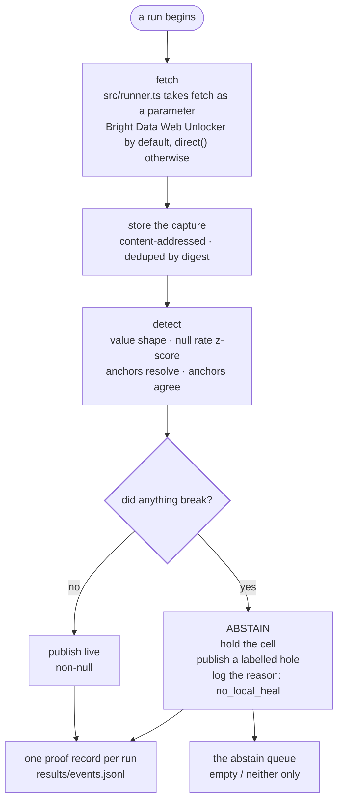

One pipeline, owned by `worker` and implemented in `src/runner.ts`.



<Callout type="warn" title="No heal node in the live path -- own it as a product cut">
  There used to be one: `healGated` ranked every candidate on the changed page
  against the fingerprint and published a "healed" value when the margin gate
  cleared. It is retired -- deleted from `src/runner.ts::evaluate()` entirely.
  A break quarantines, unconditionally, with reason `no_local_heal`. Recovery
  is exclusively Bright Data's collector repair now (`tools/bd-heal.ts`), a
  separate, human-approved, out-of-band flow this pipeline has no part in.

  `healGated` itself still exists, in `src/heal.ts` -- it just isn't called
  from here anymore. `npm run bench` and `npm run sweep` still exercise it
  directly, offline, against the archived corpus; see below.
</Callout>

## What abstain actually does

Not a retry, not a log line, not a second-best guess. From `docs/FEATURES.md`,
this is **Quarantine**, and it is the feature that defines the product:

> on abstain or on an unresolved detect, hold the cell, publish a labelled hole,
> log the reason.

The cell is **empty and labelled**, never filled. The Settings screen states the
contract as *"On a held field — leave empty — never filled, always labelled"*,
and *"Proof — one proof id per cell, on the published row — not optional"*.

There is no silent fallback anywhere on this path. `CONTRIBUTING.md` lists it
among the things a pull request gets refused for:

> **Any silent fallback** — no type defaults, no coercion, no quietly reading the
> second-best candidate. A required integer becoming `0` is indistinguishable
> downstream from a real zero. It is an absence, not a setting.

## What the corpus actually does now

`npm run replay` runs the pipeline above over all 77 archived captures:

```
replayed 74 runs across 3 sites
  ok       8
  heal     0
  abstain  66
  causes   {"selector_break":53,"semantic_drift":4,"wrong_value":9}
  held     66 cells published as labelled holes
  captures 0 stored, 66 deduped
```

Every one of the 66 cases that used to heal now abstains instead -- there is no
gate left in this path to clear. `results/events.jsonl` holds one proof record
per run, and `git diff results/events.jsonl` comes back empty precisely because
this number is checked against the code that produces it, not asserted as copy.

## The offline gate `npm run bench` still measures

`healGated`'s margin rule -- `score > tau (0.60) AND score - runner_up > delta
(0.16)` -- is unchanged, and `src/heal.ts` still ships it. `npm run bench`
mutates the same three sites' pages and grades three arms, including this gate,
against 153 constructed cases with known ground truth:

```
margin gate (t0.6/d0.16)      153    60.8%      64.7%         0.0%       35.3%
```

**Both conditions, not either.** `tau` asks whether the best candidate is good
enough in absolute terms. `delta` asks whether it is *distinguishably* better
than the next one — and that second question is the one nobody else asks. A
candidate can look very much like the thing you lost and still be the wrong
answer, if something else looks nearly as much like it. When two candidates are
that close, picking one is a coin flip, and a coin flip is not a heal -- which
is the whole reason this pipeline no longer lets it publish one.

<Callout title="0.60 and 0.16 are fitted values">
  They came out of `tools/sweep.ts`: an 11 x 10 grid, 110 points, scored over
  these pages and these mutations. `results/sweep.json` holds the surface.

  That makes them **arguments to the benchmark**, not constants with standing
  in the live pipeline anymore. There was never evidence they transfer to
  another vertical, another field type, or another site's markup conventions —
  see [Limitations §5](/docs/limitations#the-thresholds-are-calibrated-on-this-corpus-and-nowhere-else).
</Callout>

### The benign-tie escape hatch, in that offline gate

`healGated` has one exception to the margin rule, and it is narrow. When the
margin is thin it collects every candidate within `delta` of the best and, if
**all of them carry the same text**, it heals anyway with
`reason: "benign_tie"` — on the grounds that it does not matter which node you
read an identical string from.

It is genuinely narrow, and [Limitations §1](/docs/limitations#it-abstains-when-it-does-not-need-to-on-wrapper-mutations)
documents two live cases where it failed to fire and cost an unnecessary
abstention. Both are about the benchmark arm; neither reaches a live cell now.

<Callout type="warn" title="What replay showed before this changed: zero abstentions on real drift">
  Before this pipeline dropped the gate, two and a half years of real drift
  across three sites never once produced a near-tie: when those pages moved,
  the right answer won by a wide margin — run 51 was typical, **0.8787 against
  a runner-up of 0.3763, a margin of 0.50 against a threshold of 0.16**.

  So on the only real-world data this repository ever measured the *live* gate
  against, it was inert — it cost nothing and caught nothing there. Every
  abstention this project has recorded from that arm came from a manufactured
  near-tie: 54 from the benchmark's deliberate mutations, 4 from the deployed
  testbed. That is a fact about the retired live gate, not the current
  pipeline, which now abstains on every one of the 66 replayed cases above
  regardless of margin.
</Callout>

## Attributed causes

The replay classifies each of the 66 held cells by what it decided had gone wrong:

| cause | runs |
|---|---|
| `selector_break` | 53 |
| `wrong_value` | 9 |
| `semantic_drift` | 4 |

`detect()` emits a deterministic English diagnosis derived from those signals.
It is deliberately **not** passed through a language model — an LLM narrator is
on the anti-features list, because *"it will eventually produce a fluent cause
that contradicts `attributed_cause`, and the user will believe the fluent one"*.
